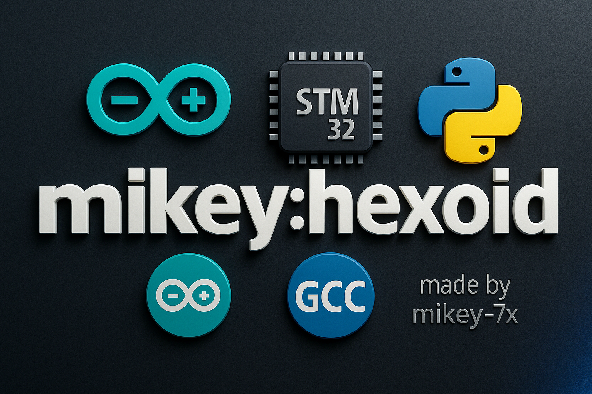

# ⚡ Mikey:hexoid

> **Multi-MCU HEX compiler toolkit for Arduino, AVR & STM32 – optimized for Termux/Debian on ARM64**

[](https://raw.githubusercontent.com/mikey-7x/mikey-hexoid/main/mikey-hexoid-install.sh)
[-orange?style=for-the-badge&logo=linux)](#)
[](#)
[](#)

---

## 🔷 What is **Mikey:hexoid**?

**Mikey:hexoid** is a **single-script microcontroller build system** designed to run on:

- **Debian inside Termux on Android** (ARM64 / aarch64)  
- Or any Debian-like environment with `bash`, `python3`, and `apt`.

It gives you a **unified CLI tool** called `mhex` which can:

- Compile **Arduino sketches** (`.ino`) to `.hex` for:
  - Arduino Uno, Nano, Mega, Micro…
  - Bare AVR chips (ATmega8A, ATmega328P, ATtiny85, etc. via MiniCore/MightyCore/attiny core)
- Compile **STM32** firmware:
  - **Bare-metal C** (startup + linker + direct registers)
  - **Mikey STM32 Core**: Arduino-style API with MCU pin names like `PC13`, `PA0`, etc.
- Convert:
  - Arduino → STM32 (Mikey core C)
  - STM32 Mikey core → Arduino `.ino`
- Install Arduino/STM32 libraries from **ZIP files** on your phone.
- Mirror compiled HEX/BIN files into your Android storage, ready to upload using apps like:
  - **ZFlasher AVR**
  - **STM32 Utils**
  - USBASP/FTDI flashing tools, etc.

All of this is driven by a **single installer script**:  
`mikey-hexoid-install.sh`.

---

## 🔶 Why Mikey:hexoid?

Typical problems when trying to do embedded development on Android/Termux:

- PlatformIO doesn’t support your exact environment or architecture properly.
- Arduino IDE is heavy, GUI-based, and not Termux-friendly.
- STM32 + AVR bare chips often require separate toolchains and complex configs.
- HEX files built for one MCU don’t run on another (e.g., Uno HEX on ATmega8A).

**Mikey:hexoid** solves this with:

- **One unified CLI tool** (`mhex`) for **many MCUs**.
- **Presets** for popular boards and bare chips (Uno, Nano, ATmega8A, Bluepill…).
- **Fuse-aware AVR presets** (e.g., ATmega8A @ 16 MHz external crystal).
- **STM32 Arduino-style API** using MCU pin names (`PC13`, `PA0`, `PA8`, etc.).
- **Automatic HEX mirroring** into `/storage/emulated/0/Android/media/hex files`.
- **Self-healing & diagnostics** (`mhex doctor`) to check and guide fixes.

---

## ⚙️ How it Works (High Level)

### Internally, Mikey:hexoid:

1. Creates a structured directory:

   ```text
   ~/mikey-hexoid/
     bin/        # mhex, arduino-cli, helpers
     config/     # arduino-cli.yaml, mikey-hexoid.json (presets, stats)
     sketches/   # your projects
     hex/        # compiled outputs (.hex/.bin)
     libs/       # arduino & stm32 libs (including ZIP-installed)
     logs/       # build logs, conversion logs, doctor logs
     venv/       # python virtual environment (rich, pygments, pyserial)

2. Installs and configures:

arduino-cli (ARM64 binary)

AVR cores: arduino:avr, MiniCore, MightyCore, MegaCore, MicroCore, attiny

arm-none-eabi-gcc for STM32 builds

Python helpers for colored UI and serial monitor support (optional).


3. Creates the mhex Python CLI:

Handles all subcommands: new, compile, stm32-mikey-*, stm32-bare-*, convert-*, lib-add-zip, etc.

Tracks build stats, last build kind, success, and stores them in JSON.

Displays clean, colored output using rich.


4. Automatically mirrors HEX/BIN builds to:

/storage/emulated/0/Android/media/hex files/

so your Android apps can easily see and upload them.


---

🧩 Applications

Arduino development on a phone, without Arduino IDE.

Bare AVR chip development:

ATmega8A, ATmega328P, ATtiny85, etc.


STM32 Bluepill/Blackpill/Nucleo firmware, both:

Bare-metal C low-level

Arduino-style with MCU pin names.


Educational:

For B.Tech/Diploma electronics students learning:

MCUs

Toolchains

Bare-metal programming


Mobile lab setup:

Use your Android phone + OTG + USBASP/FTDI/ST-Link + Mikey:hexoid + ZFlasher/STM32 Utils.


---

✅ Features (v4.0.0)

🟦 AVR / Arduino

Compile .ino sketches for:

uno, nano, mega, micro


Bare chips:

atmega8a (MiniCore, 16 MHz external)

atmega328p-bare (MiniCore)

attiny85 (attiny core)


Uses arduino-cli with presets so you don’t have to remember FQBN strings.


---

🟩 STM32

1. STM32 Bare-Metal

Low-level projects with:

main.c, startup_stm32f103.c, linkers (stm32f103c8t6.ld).


You work directly with registers like RCC_APB2ENR, GPIOC_CRH, GPIOC_ODR.


2. Mikey STM32 Core (Arduino-like, MCU pin names)

High-level API:
```
#include "mikey_core.h"

void setup(void) {
    pinMode(PC13, OUTPUT);
}

void loop(void) {
    digitalWrite(PC13, HIGH);
    delay(300);
    digitalWrite(PC13, LOW);
    delay(300);
}
```
Support for:

PC13, PA0, PA8, analogRead(PA0), analogWrite(PA8, 128), millis(), delay(), etc.


---

🟨 Smart Converters

Arduino → STM32 Mikey:
```
mhex convert-arduino-to-stm32 blink bp_from_blink
```
where 'blink' is .ino file and it converts to hex of 'bp_from_blink'(rename of 'blink') which is compiled for stm32 modules 

Converts .ino → sketch.c for STM32 Mikey core.

Auto-adds includes, tries to map functions, builds project, and mirrors HEX.


STM32 Mikey → Arduino:
```
mhex convert-stm32-to-arduino bluepill2 blink_from_bluepill2
```
Converts STM32 Mikey core code into Arduino sketch.

If build fails, logs the exact issue and where to edit.


---

🟥 ZIP Library Installer

Install custom or community libraries:
```
mhex lib-add-zip
```
Asks for folder path (e.g. /sdcard/Download).

Lists all .zip files.

Installs into:

~/mikey-hexoid/libs/arduino/<LibName>/

Avoids exact duplicates; upgrades when version differs.


List installed libraries:

mhex libs


---

🟧 Self-Healing & Safety

mhex doctor:

Checks cores, toolchains, configs.

Shows JSON config with presets and build stats.


No infinite loops: all auto-fix routines are bounded and logged.

Only uses internet to:

Download toolchains & cores.

Optionally update libraries/cores.


Never auto-runs untrusted code from the internet.


---

📥 Installation

> Requires:

Debian (or Debian chroot)

bash, curl, python3, apt

On Android, recommended: Termux + Debian (proot-distro)


1️⃣ Download installer script
```
cd ~
curl -LO https://raw.githubusercontent.com/mikey-7x/mikey-hexoid/main/mikey-hexoid-install.sh
chmod +x mikey-hexoid-install.sh
```
2️⃣ Run the installer
```
./mikey-hexoid-install.sh
```
You should see something like:

==============================================
 
 mikey:hexoid v4.0.0 installation complete!

Open a NEW shell or run:
```
  source ~/.bashrc
```
Then test:
```
  mhex doctor
```
```
  mhex new blink
```
  ```
  mhex compile blink --preset uno
  ```
==============================================

3️⃣ Refresh environment
```
source ~/.bashrc
```
4️⃣ Verify installation
```
mhex doctor
```
You should see cores like:

arduino:avr
MiniCore:avr
MightyCore:avr
MegaCore:avr
MicroCore:avr
attiny:avr

And config JSON similar to:
```
"presets": {
  "uno": {"type": "avr", "fqbn": "arduino:avr:uno"},
  "nano": {"type": "avr", "fqbn": "arduino:avr:nano"},
  "mega": {"type": "avr", "fqbn": "arduino:avr:mega"},
  "micro": {"type": "avr", "fqbn": "arduino:avr:micro"},
  "atmega8a": {
    "type": "avr",
    "fqbn": "MiniCore:avr:8",
    "board_options": "clock=16MHz_external"
  },
  "atmega328p-bare": {
    "type": "avr",
    "fqbn": "MiniCore:avr:328",
    "board_options": "clock=16MHz_external"
  },
  "attiny85": {
    "type": "avr",
    "fqbn": "attiny:avr:ATtinyX5"
  },
  "bluepill": {
    "type": "stm32",
    "backend": "mikey",
    "mcu": "stm32f103c8"
  },
  "f103-bare": {
    "type": "stm32",
    "backend": "bare",
    "mcu": "stm32f103c8"
  }
}

```

---

📚 Command Reference & Examples

🔹 1. Create a new Arduino sketch
```
mhex new blink
```
This creates:

~/mikey-hexoid/sketches/blink/blink.ino

Edit it:
```
nano ~/mikey-hexoid/sketches/blink/blink.ino
```
Example content:
```
int led = 13;

void setup() {
  pinMode(led, OUTPUT);
}

void loop() {
  digitalWrite(led, HIGH);
  delay(500);
  digitalWrite(led, LOW);
  delay(500);
}
```

---

🔹 2. Compile for Arduino Uno
```
mhex compile blink --preset uno
```
Output:

[✔] Compile OK
HEX file: ~/mikey-hexoid/hex/blink/blink.ino.hex
Mirrored HEX/BIN -> /storage/emulated/0/Android/media/hex files/blink.ino.hex

You can now upload blink.ino.hex using ZFlasher AVR, etc.


---

🔹 3. Compile for ATmega8A (bare chip, 16 MHz external)
```
mhex compile blink --preset atmega8a
```
Same Arduino code, but HEX is built for ATmega8A
→ confirmed working on real hardware with 16 MHz crystal.


---

🔹 4. Compile for ATmega328P bare chip
```
mhex compile blink --preset atmega328p-bare
```
Again, same .ino code.


---

🔹 5. STM32 – Mikey Core (Arduino-style, MCU pins)

Create project:
```
mhex stm32-mikey-init bluepill2
```
Edit:
```
nano ~/mikey-hexoid/sketches/bluepill2_stm32_mikey/sketch.c
```
Example:
```
#include "mikey_core.h"

void setup(void) {
    pinMode(PC13, OUTPUT);
}

void loop(void) {
    digitalWrite(PC13, HIGH);
    delay(300);
    digitalWrite(PC13, LOW);
    delay(300);
}
```
Build:
```
mhex stm32-mikey-build bluepill2
```
HEX will appear in both:

~/mikey-hexoid/hex/
and
/storage/emulated/0/Android/media/hex files/


---

🔹 6. STM32 – Bare-Metal
```
mhex stm32-bare-init f103test
nano ~/mikey-hexoid/sketches/f103test_stm32_bare/main.c
mhex stm32-bare-build f103test
```

---

🔹 7. Arduino → STM32 Conversion
```
mhex convert-arduino-to-stm32 blink bluepill_from_blink
```
Creates a Mikey STM32 project.

Converts .ino → sketch.c.

Builds and mirrors HEX.


---

🔹 8. STM32 → Arduino Conversion
```
mhex convert-stm32-to-arduino bluepill2 blink_from_bluepill2
```
If build fails:

You get:

Path to converted .ino

Path to detailed error log in ~/mikey-hexoid/logs/.


---

🔹 9. Library Management

List installed libraries:

mhex libs

Install from ZIP:

mhex lib-add-zip

Enter path, e.g.:

/sdcard/Download

Select ZIP by number.

It will install into ~/mikey-hexoid/libs/arduino/.

---


---

🔹 10. Check boards, stats & config

Boards (presets):

mhex boards

Stats:

mhex stats

Config JSON:

mhex config

Change external hex dir (optional):

mhex config-hex-dir "/storage/emulated/0/Android/media/hex files"

---

✅ How STM32 board selection works in mikey:hexoid

Unlike AVR (which uses Arduino FQBN presets), STM32 in mikey:hexoid uses backend type + MCU model:

mikey:hexoid supports 2 STM32 backends:

Backend	Purpose	Arduino-like?

mikey	Arduino-style API (pinMode, digitalWrite)	✔ Yes
bare	Pure C CMSIS startup	❌ No (Low-level)


mikey:hexoid presets look like:
```
"bluepill": {
    "type": "stm32",
    "backend": "mikey",
    "mcu": "stm32f103c8"
},
"f103-bare": {
    "type": "stm32",
    "backend": "bare",
    "mcu": "stm32f103c8"
},
"blackpill-f401": {
    "type": "stm32",
    "backend": "mikey",
    "mcu": "stm32f401"
},
"blackpill-f411": {
    "type": "stm32",
    "backend": "mikey",
    "mcu": "stm32f411"
},
"nucleo-f103": {
    "type": "stm32",
    "backend": "mikey",
    "mcu": "stm32f103rb"
},
"nucleo-f401": {
    "type": "stm32",
    "backend": "mikey",
    "mcu": "stm32f401re"
}

```
---

✅ 1. Check all supported STM32 boards

Run:
```
mhex boards
```
Example output:
```
Available Presets:
  bluepill → STM32F103C8 (Mikey Core)
  f103-bare → STM32F103C8 (Bare-metal)
  blackpill-f401 → STM32F401 (Mikey Core)
  blackpill-f411 → STM32F411 (Mikey Core)
  nucleo-f103 → STM32F103RB (Mikey Core)
  nucleo-f401 → STM32F401RE (Mikey Core)

```
---

✅ 2. How to create a new STM32 project for a specific board

Example: Bluepill (F103C8)
```
mhex stm32-mikey-init blue_test --preset bluepill
```

For Blackpill F401:
```
mhex stm32-mikey-init myF401 --preset blackpill-f401
```

For Nucleo F401RE:
```
mhex stm32-mikey-init myNucleo --preset nucleo-f401
```

---

✅ 3. How to build for that board
```
mhex stm32-mikey-build blue_test
```

It automatically detects the preset you used during “init”.


---

❗ IMPORTANT

Do NOT use --preset for STM32 builds.
Presets are used only during project creation.

After project is created, the metadata inside the project folder stores the board type.


---

💡 4. How to compile STM32 without presets (manual way)

If you want to force a build for any STM32 MCU:
```
mhex stm32-mikey-build myproj --mcu stm32f411 --backend mikey
```

or bare-metal:
```
mhex stm32-bare-build myproj --mcu stm32f103c8

```
---

🎯 5. Adding more STM32 boards (custom presets)

If your board is not listed, create your own preset:
```
mhex preset-add f446-black \
  --type stm32 \
  --backend mikey \
  --mcu stm32f446re
```

Check:

mhex boards

Now create projects for that board:
```
mhex stm32-mikey-init test446 --preset f446-black
```

---

✔ Supported MCU models

You can build for any STM32F0, F1, F3, F4 (most common ones):

Examples:

stm32f030f4

stm32f051

stm32f103c8

stm32f103rb

stm32f401cc

stm32f401re

stm32f411ce

stm32f446re

stm32f407vg


Just specify them in preset or manual build.


---

⭐ Summary

To select STM32 board:

Step	Command

See all boards:	mhex boards
Create project:	
mhex stm32-mikey-init myproj --preset bluepill
Build project:
mhex stm32-mikey-build myproj
Add new board:
mhex preset-add <name> --type stm32 --backend mikey --mcu <chip>

---

🔍 Troubleshooting

mhex doctor
Always the first command when something looks wrong.

If arduino-cli fails:

Check internet

Re-run installer

Or manually run arduino-cli core update-index


If HEX doesn’t work on bare AVR:

Confirm:

Correct preset (e.g., atmega8a)

Crystal value (16 MHz)

Correct fuses (MiniCore usually handles this)

External programmer (USBasp/FTDI) correctly wired.


---

🔮 Future Advantages & Roadmap

Planned / possible extensions:

More MCUs:

ATmega32, AT90 families, more STM32 families, RP2040, ESP.


GUI front-end (web-based or TUI editor).

Enhanced converter engine (more complex sketches).

Built-in project templates for:

Sensors, displays, communication protocols.


Integrated docs per MCU preset.

---

## 🧾 Copyright & Authors

**© 2025 Mikey (mikey-7x)**  
Creator & Lead Developer – *Mikey:hexoid Project*  
Electronics Engineer (Diploma E&C) | B.Tech Electronics | Embedded Systems Developer

Created & maintained by:
🔷 Mikey-7X  
GitHub: https://github.com/mikey-7x  
Date:9/12/2025

All rights reserved.  

Mikey:hexoid is built from the idea that

> “Your phone can be your entire lab.”

---

## 👨‍💻 Core Developers & Acknowledgements

### 🔷 Primary Developer  
- **Mikey (mikey-7x)**  
  - Concept design  
  - AVR/ST Microcontroller architecture integration  
  - STM32 Arduino-style Mikey Core  
  - Build system logic & testing  
  - Algorithm design for converters (Arduino ↔ STM32)

---

### 🟦 Special Thanks To:

#### **1. Arduino Project & Developers**  
This project integrates technologies provided by:  
- **Arduino Team** – for `arduino-cli`, AVR cores, hardware definitions, and open-source toolchains.  
- **MiniCore, MightyCore, MegaCore, MicroCore** authors  
  - *MCUdude* → https://github.com/MCUdude  
  (for ATmega8A, ATmega328P, ATmega32, ATtiny builds)

Their incredible open-source contributions made cross-MCU compilation possible.

#### **2. STM32 Open-Source Contributors**  
- ARM GCC Toolchain maintainers  
- STM32 low-level / bare-metal community  
- libopencm3 contributors  

#### **3. Android Tools Used in Workflow**  
HEX uploaders on Android (external, optional):

| Tool | Purpose | Play Store Link |
|------|---------|----------------|
| **ZFlasher AVR** | Upload HEX to AVR / USBasp / Arduino | https://play.google.com/store/apps/details?id=ru.zdevs.zflasheravr |
| **STM32 Utils** | Upload HEX/BIN to STM32 (USB/Serial/DFU) | https://play.google.com/store/apps/details?id=com.martinloren.stm32utils |

*(These apps are not part of Mikey:hexoid — they are optional flash tools used by many embedded engineers.)*

---

## 🛡 License Notice

Copyright © 2025 Mikey-7X  
All Rights Reserved  
“Mikey:hexoid” and its associated logo are trademarks of Mikey-7X.

----------------------------------------------------------------------
SECTION 1 — OWNERSHIP

----------------------------------------------------------------------

“Mikey:hexoid” (including all scripts, code, algorithms, libraries, 
documentation, banner artwork, AI-generated content, and design 
elements) is proprietary software created and owned by Mikey-7X.

All intellectual property rights are retained by the author.

No rights are granted except those explicitly written below.

----------------------------------------------------------------------
SECTION 2 — PERMITTED USE

----------------------------------------------------------------------

You are allowed to:

• Download and install Mikey:hexoid  
• Use the software for personal, educational, and research purposes  
• Compile your own Arduino/AVR/STM32 sketches using this toolkit  
• Generate HEX files for your microcontrollers  

The following MUST remain intact:

• Copyright notice  
• This license file  
• Author attribution: “Created by Mikey-7X”  

----------------------------------------------------------------------
SECTION 3 — STRICTLY PROHIBITED ACTIONS

----------------------------------------------------------------------

Without explicit written permission from the author (Mikey-7X), you 
may NOT:

• Copy, clone, fork, or redistribute this project or its source code  
• Upload or host this project on any other platform  
• Modify, alter, or create derivative works  
• Use this software in commercial products or services  
• Sell, rent, sublicense, or repackage this project  
• Reverse-engineer or attempt to extract proprietary logic  
• Reuse the project name “Mikey:hexoid” or its trademark  

Any violation constitutes infringement and may lead to legal action.

----------------------------------------------------------------------
SECTION 4 — THIRD-PARTY TOOLS & ATTRIBUTIONS

----------------------------------------------------------------------

Mikey:hexoid internally uses—and is compatible with—several external
open-source tools and compilers. These tools are NOT included as part 
of Mikey:hexoid’s proprietary code. They remain the intellectual 
property of their respective owners under their own licenses:

• **Arduino CLI** — © Arduino LLC / Arduino Srl  
  Licensed under the GNU General Public License (GPL v3)

• **avr-gcc / arm-none-eabi-gcc** — © Free Software Foundation  
  Licensed under GNU GPL and GNU LGPL

• **MiniCore / MegaCore / MightyCore / MicroCore** (for AVR chips)  
  © MCUdude (GitHub: MCUdude) — Various open-source licenses

• **pyserial, rich, pygments** — © Respective Python package authors  
  Licensed under open-source terms (BSD, MIT)

• **dfu-util / stm32flash / stlink-tools**  
  © Their respective maintainers — various open-source licenses

These tools are **not modified** or redistributed by Mikey:hexoid.
They are executed as external dependencies under their respective 
licenses.

Mikey:hexoid contains only proprietary automation, compilation 
orchestration logic, UI/UX design, conversion engines, and support 
systems written by Mikey-7X.

----------------------------------------------------------------------
SECTION 5 — WARRANTY DISCLAIMER

----------------------------------------------------------------------

THIS SOFTWARE IS PROVIDED “AS IS,” WITHOUT ANY WARRANTY OF ANY KIND.

The author makes no guarantees regarding:

• Accuracy of generated HEX/BIN files  
• Compatibility with third-party upload tools  
• Safety in hardware usage  
• Absence of bugs or interruptions  

Use of this software is entirely at your own risk.

----------------------------------------------------------------------
SECTION 6 — TRADEMARK NOTICE

----------------------------------------------------------------------

“Mikey:hexoid™” is an unregistered trademark of Mikey-7X.

You may NOT:

• Use the name or logo  
• Create similar branding  
• Impersonate the project  

----------------------------------------------------------------------
SECTION 7 — REQUESTING PERMISSION

----------------------------------------------------------------------

To request commercial use rights, redistribution, or collaboration,
contact:

  Author: Mikey-7X  
  Email: (you can add it here later)

Only written approval is legally valid.

----------------------------------------------------------------------
END OF LICENSE

----------------------------------------------------------------------

This software is protected under international copyright laws.
Unauthorized distribution or modification will result in legal action.

---
